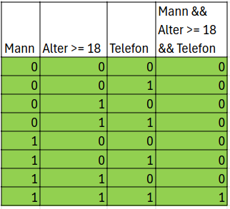
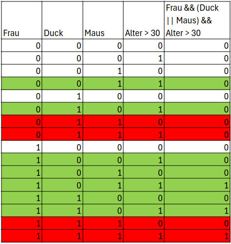
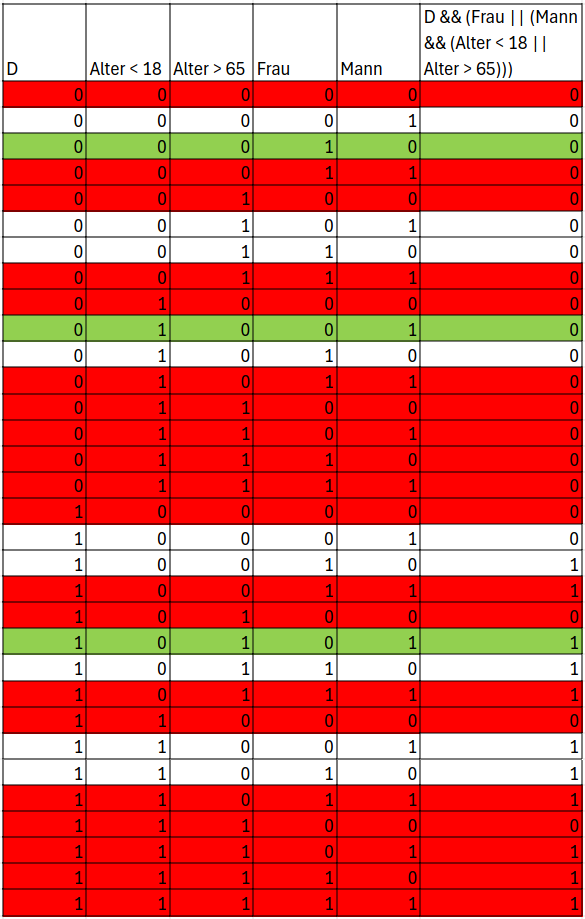

# 2a)

# 2b)

Rote Zeilen sind unmögliche Fälle, eine Person kann nicht zwei verschiedene Nachnahmen haben.

# 2c)

Rote Zeilen sind unmögliche Fälle, eine Person kann nicht ein Mann und eine Frau sein und keins von beiden und unter 18 und über 65 Jahre alt sein.

# 2d)

Mit Lazy Evauluation können bestimmte Verzweigungen nicht abgedeckt werden, da beispielsweise bei `x || (y && z)`, wenn x True ist, dann wird nie das UND evaluiert und somit kann nicht getestet werden, was mit y und z passiert.